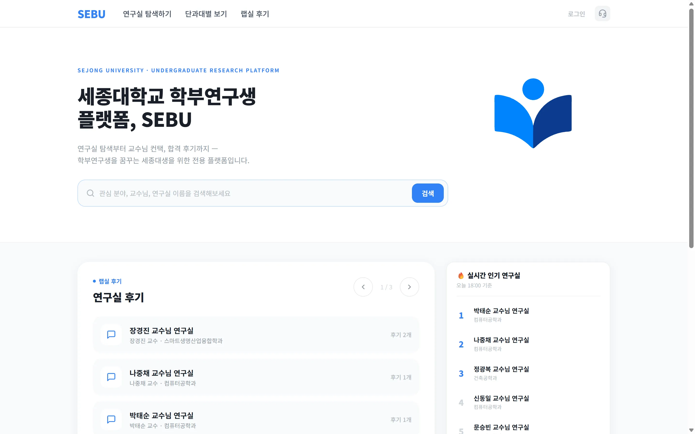
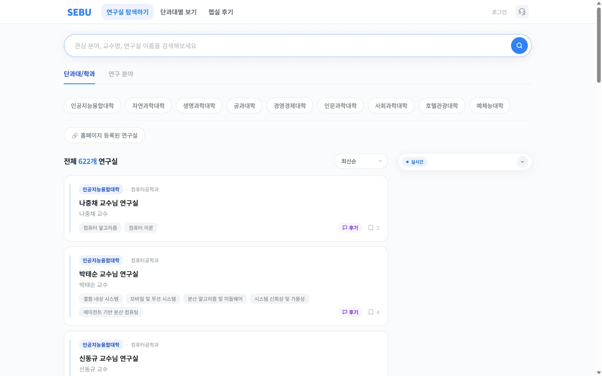
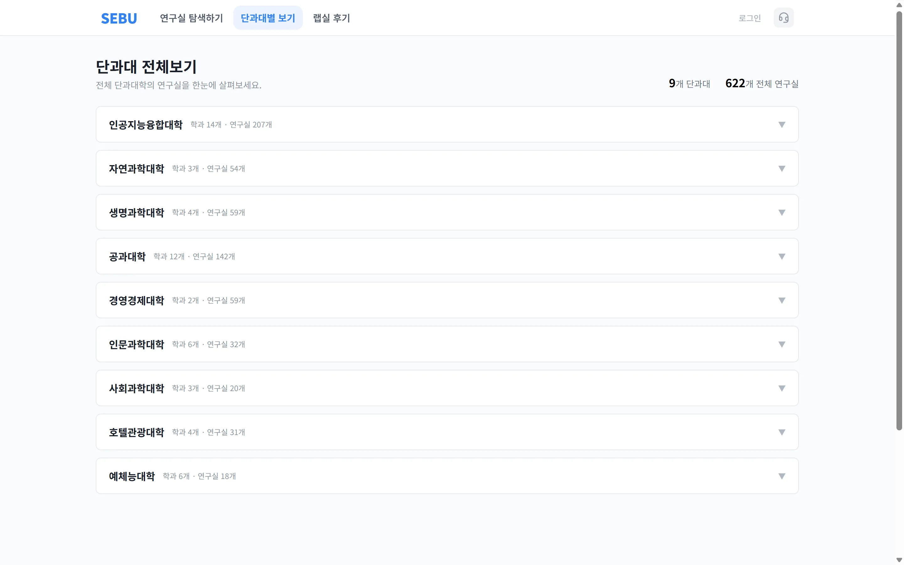
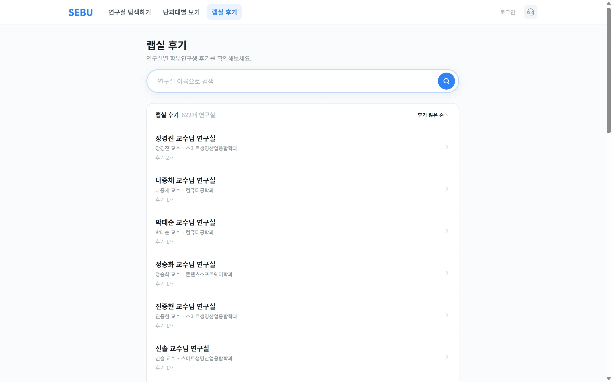

  

  <h1>SEBU</h1>
  
<strong>세종대학교 학부연구생을 위한 연구실 탐색 플랫폼</strong>

  
나에게 맞는 연구실을 찾는 첫걸음, SEBU와 함께하세요.

  

    <a href="https://sebu-frontend.vercel.app"><strong>서비스 바로가기</strong></a>
    &nbsp; · &nbsp;
    <a href="https://github.com/greedy-team/SEBU-frontend"><strong>Frontend Repository</strong></a>
  

---

## 🔹 SEBU를 소개해요

### 학부연구생을 시작하고 싶지만, 어떤 연구실이 나와 맞을지 고민되시나요?

**SEBU는 세종대학교 학생들이 연구실을 탐색하고, 연구실 후기를 살펴볼 수 있는 학부연구생 플랫폼입니다.** 관심 분야부터 교수님, 연구실 정보까지 한곳에서 찾아보세요.

## 🔹 주요 기능

### 🫧 01. 관심 있는 연구실 검색하기

관심 분야, 교수님 이름, 연구실 이름으로 연구실을 찾아보세요. 학부연구생으로서의 첫걸음을 내딛기 위한 탐색을 시작할 수 있어요.

[연구실 탐색하기 →](https://sebu-frontend.vercel.app/search)

### 🫧 02. 단과대학별로 둘러보기

세종대학교의 단과대학과 학과별로 연구실을 둘러보세요. 전공에 맞는 연구실부터 새로운 관심 분야까지 차근차근 살펴볼 수 있어요.

[단과대별 보기 →](https://sebu-frontend.vercel.app/colleges)

### 🫧 03. 연구실 후기 살펴보기

연구실을 선택하기 전, 다른 학생들이 남긴 후기를 확인해보세요. 연구실 탐색과 함께 실제 경험을 참고할 수 있어요.

[랩실 후기 보기 →](https://sebu-frontend.vercel.app/community/labs)

## 🔹 Frontend

**[SEBU-frontend](https://github.com/greedy-team/SEBU-frontend)**

SEBU 웹 서비스의 프론트엔드 소스 코드를 관리하는 저장소입니다. React와 Vite를 기반으로 개발하며, 개발 관련 문서와 이슈는 FE 저장소에서 확인할 수 있어요.

> 이 저장소는 SEBU의 서비스 소개를 위한 공간입니다. 프론트엔드 코드는 위의 별도 저장소에서 관리합니다.

---

  
<strong>SEBU · 세종대학교 학부연구생 플랫폼</strong>

  
<a href="mailto:sebusupport@gmail.com">서비스 문의</a> · <a href="https://sebu-frontend.vercel.app">SEBU 방문하기</a>

## 🔹 People

SEBU를 함께 만드는 사람들입니다.

<table>
  <tr>
    <td align="center" width="140"><a href="https://github.com/rahwan10"> <strong>rahwan10</strong></a></td>
    <td align="center" width="140"><a href="https://github.com/kokunut"> <strong>kokunut</strong></a></td>
    <td align="center" width="140"><a href="https://github.com/hapdaypy"> <strong>hapdaypy</strong></a></td>
    <td align="center" width="140"><a href="https://github.com/chaehyunL"> <strong>chaehyunL</strong></a></td>
    <td align="center" width="140"><a href="https://github.com/Kdahyn"> <strong>Kdahyn</strong></a></td>
  </tr>
</table>
